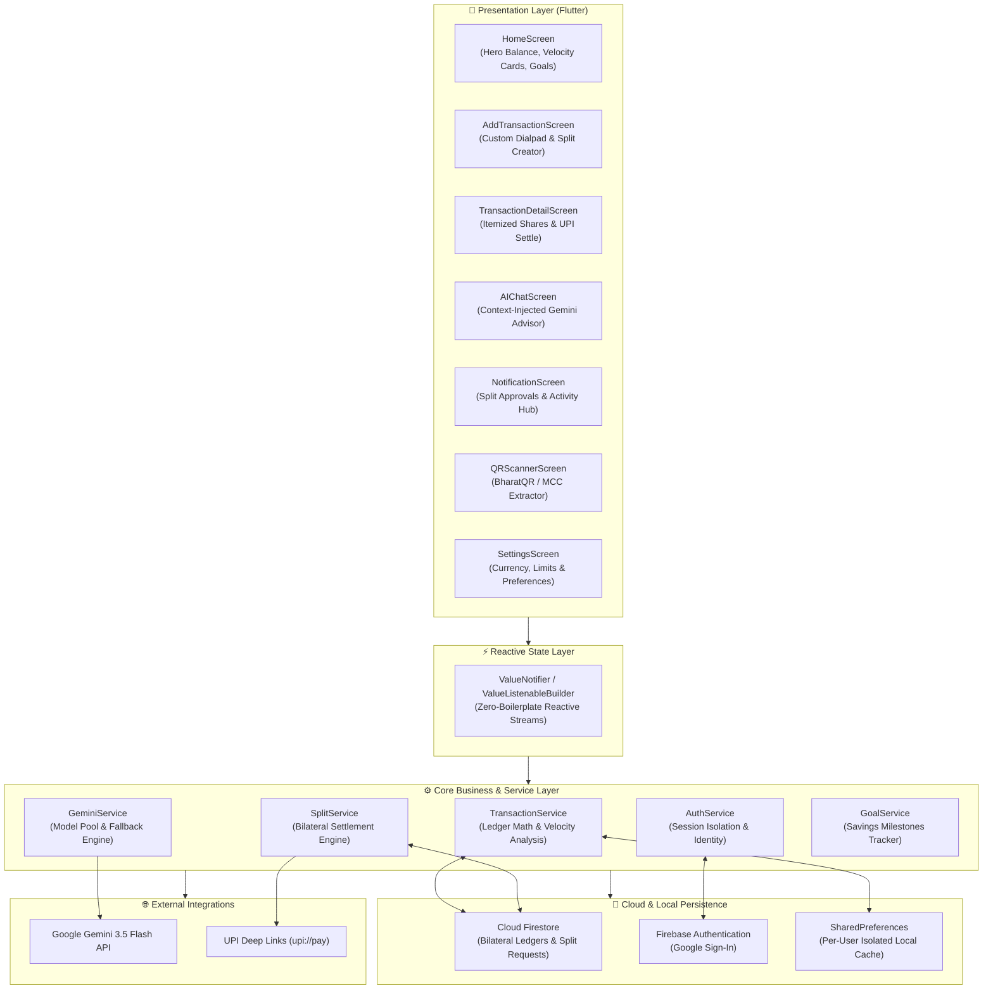
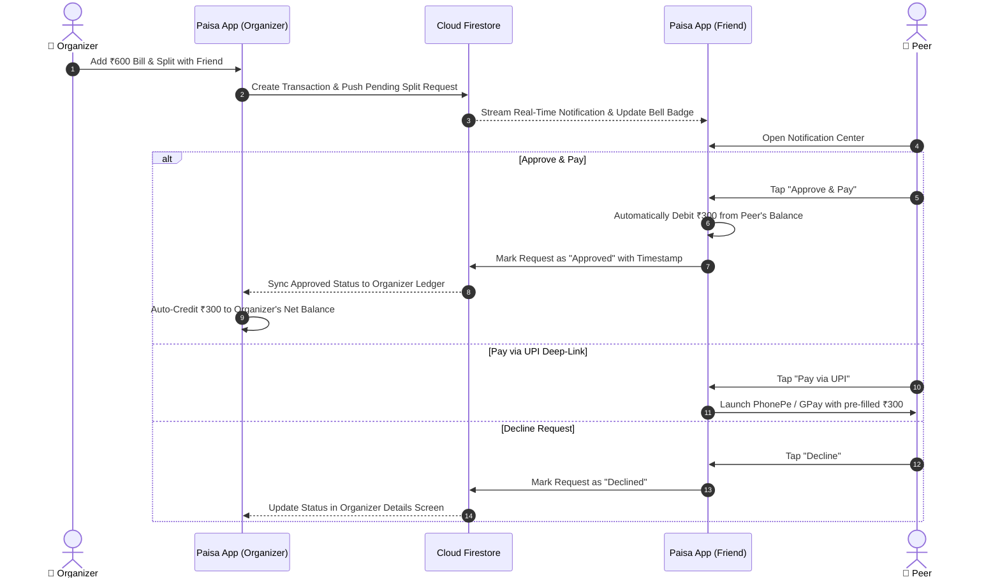

<div align="center">


# 💸 Paisa — AI-Powered Expense Tracker & Bill Splitter

### *Next-generation personal finance, bilateral bill-splitting ledger, and context-aware AI financial intelligence for mobile.*

---

[](https://flutter.dev)
[](https://dart.dev)
[](https://firebase.google.com)
[](https://ai.google.dev)
[](https://flutter.dev)
[-success?style=for-the-badge&logo=checkmarx&logoColor=white)](#-automated-testing-suite)
[](LICENSE)

<br/>

[Key Features](#-key-features) • [System Architecture](#-system-architecture) • [Settlement Workflow](#-bilateral-settlement-flow) • [Tech Stack](#-tech-stack) • [Getting Started](#-getting-started) • [Testing](#-automated-testing-suite) • [License](#-license)

</div>

---

## 📖 Overview

**Paisa** is an enterprise-grade personal finance management and bilateral peer-to-peer bill-splitting mobile application. Inspired by elite Behance fintech design systems, Paisa merges automated expense tracking, smart QR code merchant parsing, and multi-user bill splitting with **Google Gemini 3.5 AI** to deliver real-time financial health audits and personalized budget recommendations.

Built with an offline-first philosophy, Paisa ensures uninterrupted access to financial logs, mathematical budget projections, and split settlements—even in zero-connectivity environments.

---

## 🌟 Key Features

### 🤝 Bilateral Peer-to-Peer Bill Splitting
* **Shared Cross-Account Ledger:** Split expenses equally or by custom amounts. Automatically registers pending obligations across recipient accounts via Cloud Firestore.
* **Real-Time In-App Alert System:** Dedicated in-app notification center with real-time badges notifying peers of new split requests and settlement updates.
* **1-Tap Settle & Debit:** Participants can approve and pay directly within the app (automatically debited from their balance) or decline with custom status updates.
* **Automatic Organizer Settlement:** When the organizer opens the app, approved shares are automatically calculated, settling the ledger and crediting their balance.
* **UPI Deep-Linking Engine:** Pre-fills `upi://pay` dynamic URLs with payee VPA, payee name, transaction note, and amount for instant payment execution in PhonePe, Google Pay, or Paytm.
* **Automated Reminders:** Formats and copies polite reminder templates directly to the clipboard with one tap.

### 🤖 Context-Aware AI Financial Advisor
* **Powered by Google Gemini 3.5 Flash:** Interactively queries your financial history to assess spending habits, discretionary purchases, and runway.
* **Real-Time Context Injection:** Passes live balance, monthly burn rate, category spending velocity, and savings goal progress into the prompt payload.
* **50/30/20 Budgeting Intelligence:** Automatically breaks down your historical expenses into Needs, Wants, and Savings milestones.
* **Local Deterministic AI Engine:** Resilient dual-layer architecture falls back to an embedded deterministic heuristics engine when offline or if API quotas are exhausted.

### ⚡ Smart QR & Merchant MCC Auto-Categorization
* **BharatQR & UPI Scanner:** Built-in camera scanner instantly decodes BharatQR and UPI QR standards.
* **Automated Merchant Category Classification (MCC):** Identifies MCC codes to classify expenses automatically into *Food & Dining*, *Groceries*, *Fuel*, *Shopping*, or *Utilities* without manual data entry.

### 🎯 Goal Tracking & Spend Ratio Analytics
* **Visual Milestone Sliders:** Track multiple target savings funds (e.g., Emergency Fund, MacBook Pro, Vacation) with interactive progress rings.
* **Behance-Style Spend Ratios:** Intuitive daily and weekly spending velocity percentages relative to current liquid balances, color-coded with dynamic health indicators.
* **Custom Category Limits:** Set monthly thresholds with warnings when approaching budget limits.
* **Multi-Currency Engine:** Seamlessly toggle between Rupee (`₹`), US Dollar (`$`), Euro (`€`), British Pound (`£`), and Japanese Yen (`¥`).

### 🎨 Conceptzilla Dark Fintech UI/UX
* **OLED Dark Aesthetic:** Deep graphite background (`#121315`), neon volt highlights (`#B7F23D`), and frosted glass cards.
* **Thumb-Friendly Financial Keypad:** Custom numeric dial pad designed for one-handed thumb interaction during quick expense entry.
* **Granular Transaction Breakdowns:** Detailed modal screens showing itemized participant shares, settlement status badges, and transaction timestamps.

---

## 🏗️ System Architecture

Paisa follows a reactive, decoupled service-oriented architecture designed for deterministic state synchronization and offline reliability.



---

## 🔄 Bilateral Settlement Flow

When an expense is split, Paisa coordinates the request lifecycle between organizer and recipient in real-time:



---

## 🛠️ Tech Stack

| Domain | Technology / Library | Purpose |
| :--- | :--- | :--- |
| **Framework** | [Flutter](https://flutter.dev) (SDK 3.x) | Cross-platform native mobile application (iOS & Android) |
| **Language** | [Dart](https://dart.dev) (v3.x) | Type-safe, null-safe client application logic |
| **State Management** | `ValueNotifier` & `Listenable` | Lightweight, performant reactive state bindings |
| **Authentication** | [Firebase Auth](https://firebase.google.com/products/auth) | Google Sign-In & multi-tenant identity lifecycle |
| **Cloud Database** | [Cloud Firestore](https://firebase.google.com/products/firestore) | Real-time bilateral transaction sync & remote request hub |
| **Local Storage** | `shared_preferences` | Scoped per-user offline data isolation and persistence |
| **Generative AI** | [Google Gemini 3.5 Flash](https://ai.google.dev) | High-speed, context-aware financial audit & advisory |
| **QR & Barcode** | `mobile_scanner` | Hardware-accelerated camera parsing for BharatQR & UPI |
| **Payments** | `url_launcher` | Protocol handler for `upi://pay` mobile payment intents |
| **Design System** | Custom `PaisaTheme` | Conceptzilla dark-mode palette (`#121315`), neon green (`#B7F23D`) |

---

## 📂 Project Structure

```text
lib/
├── firebase_options.dart           # Auto-generated Firebase configurations
├── main.dart                       # Application entrypoint & theme initialization
├── models/
│   └── transaction_model.dart      # Unified transaction, split participant & ledger schema
├── screens/
│   ├── home_screen.dart            # Hero net balance, velocity cards & recent transactions
│   ├── add_transaction_screen.dart # Financial dialpad, QR shortcut & participant allocation
│   ├── transaction_detail_screen.dart # Itemized breakdown, settlement status & reminder engine
│   ├── ai_chat_screen.dart         # Context-injected Gemini 3.5 AI conversational interface
│   ├── notifications_screen.dart   # In-app split requests, 1-tap accept/decline actions
│   ├── qr_scanner_screen.dart      # Real-time BharatQR scanner with MCC classification
│   ├── statistics_screen.dart      # Visual spending analytics & category distributions
│   └── settings_screen.dart        # Currency selector, theme toggle & budget limits
├── services/
│   ├── auth_service.dart           # Multi-user session isolation & Google OAuth
│   ├── gemini_service.dart         # Multi-model Gemini pool, retries & offline fallback
│   ├── split_service.dart          # Bilateral ledger accounting, lifecycle & UPI generator
│   ├── transaction_service.dart    # Isolated ledger math, spend ratios & local caching
│   └── goal_service.dart           # Milestone savings funds & completion targets
└── theme/
    └── paisa_theme.dart            # Conceptzilla color palette, typography & category icons
```

---

## 🚀 Getting Started

### Prerequisites
* [Flutter SDK](https://flutter.dev/docs/get-started/install) (version 3.19.0 or higher)
* [Xcode](https://developer.apple.com/xcode/) (for iOS deployment, macOS required)
* [Android Studio](https://developer.android.com/studio) (for Android deployment)
* A [Google AI Studio](https://aistudio.google.com/) Gemini API Key *(Optional: Paisa includes an offline fallback engine)*

### Installation & Setup

1. **Clone the repository:**
   ```bash
   git clone https://github.com/krishpatel-317/Expense-Tracker.git
   cd Expense-Tracker
   ```

2. **Install project dependencies:**
   ```bash
   flutter pub get
   ```

3. **Configure Firebase (Optional for full cloud sync):**
   * **iOS:** Place your `GoogleService-Info.plist` inside `ios/Runner/`.
   * **Android:** Place your `google-services.json` inside `android/app/`.

4. **Launch the application:**
   ```bash
   # Run on your connected physical device or emulator
   flutter run
   ```

---

## 🧪 Automated Testing Suite

Paisa enforces strict financial correctness through an automated test suite comprising **47 comprehensive test cases**. The suite verifies:
* Ledger arithmetic & floating-point currency safety.
* Bilateral settlement balance debits and auto-credits.
* Scoped per-user local storage isolation.
* Multi-participant bill splitting parity.
* Gemini context-builder formatting & deterministic offline fallback algorithms.

To execute the test suite:

```bash
flutter test test/paisa_backend_test.dart
```

```text
00:03 +47: All tests passed!
```

---

## 🤝 Contributing

Contributions, feedback, and issue reports are warmly welcomed!

1. Fork the Project (`https://github.com/krishpatel-317/Expense-Tracker`)
2. Create your Feature Branch (`git checkout -b feature/IncredibleFeature`)
3. Commit your Changes (`git commit -m 'feat: add IncredibleFeature'`)
4. Push to the Branch (`git push origin feature/IncredibleFeature`)
5. Open a Pull Request

---

## 📄 License

Distributed under the **MIT License**. See [`LICENSE`](LICENSE) for complete licensing terms.

<div align="center">
  <sub>Built with ❤️ for seamless personal finance and smart bill splitting.</sub>
</div>
